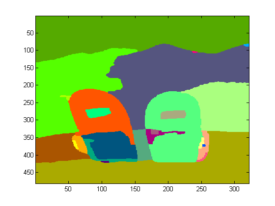

# Segmentation practice

In this lab you will code several well known segemetation strategies and then apply them on a small set of images with grundtruth annotations. 

Try to develop quality code, you will be using it for the netx Lab.

## Database


The data for this lab can be downloaded from the course server using http:

- http://157.253.63.7/Lab5Images.tar.gz

It is a small, randomly selected, subset of the BSDS500 Segmentation database (annotations  included). 

## Creating a  basic segmentation method

Implement your own segmentation method using what you have learned in class. It should be a matlab/python function with the following signature:

Matlab
```matlab
function segmentation = segmentByClustering( rgbImage, featureSpace, clusteringMethod, numberOfClusters)
```

Python
```python
def segmentByClustering( rgbImage, featureSpace, clusteringMethod, numberOfClusters):
    ...
    return segmentation
```
Where

- featureSpace : 'rgb', 'lab', 'hsv', 'rgb+xy', 'lab+xy' or 'hsv+xy'
- clusteringMethod = 'k-means', 'gmm', 'hierarchical' or 'watershed'.
- numberOfClusters positve integer (larger than 2)

The output of the function should be an  matrix with the same width and  height of the original image and only one channel, where each pixel has a cluster label. In other words, pixels that belong to the same cluster have the same positive integer.


### Notes
- You don't have to implement all the code from scratch, use the built in functions of your language.
- If you run into memory problems try scaling down the images. 
- *xy* stands for the spatial _x_ and _y_ coordinates. It does not matter which pixel of the image you label as  0,0 just be consistent, and do not forget to report it.
- You may need to normalize some channels to make them comparable, or to make some of them more/less important in the clustering process. For example _newCoords = ( α\*r, α\*g, α\*b, β\*x, β\*y)_


## Test your function

Before testing your function make sure the segmentation results are somewhat acceptable. To visualize the output of your function use something like:

```matlab
image(segm)
colormap colorcube
```

You should see an image similar to the following, where each color represents a different cluster.



Try different parameters of your function, and inspect them visually before actually testing them.


### Reading ground truth data

The file 'Lab5Images.tar.gz 'contains the segmentation ground truth data. It has the same name as the image file and is saved as matlab file (.mat). The mat file contains several manual segmentation created by human annotators.

For example, to look at the ground truth for image ``train/55075`` we can use the following code

```matlab
gt=load('BSDS500/data/groundTruth/train/55075.mat')
% Load segmentation from first human
segm=gt.groundTruth{1}.Segmentation;
image(segm)
colormap colorcube

% create a new figure
figure
% Boundaries from first human
bound=t.groundTruth{1}.Boundaries;
image(bound)
colormap flag
```

Feel free to use/implement any evaluation strategy for your segmentation function. DO NOT use the actual BSDS500 evaluation strategy (we will be there next week ;) ). Just use a simple strategy that can yield a reasonable evaluation of your segmentation function. Remember there are multiple ground truths for any given image. 

##Your turn

The report for this laboratory must include:

-   Small (Max. one paragraph per method) description of the clustering algorithms.

Segmentation parameter tuning and Image preprocessing

-   Did  you have to scale (up or down) the value of any of the channels (r,g,b,x,y). why?
-   Did you have to rescale the images, why? does it affect the result?
-   The hyperparameter 'numberOfClusters', is probably the most important parameter in this problem, how can you choose it?

Evaluation
-  How can we evaluate a general segmentation problem?, how can we handle the multiple ground truths?
-  What evaluation strategy did you choose, why?, what would be its shortcomings, if any?
-  Using only your evaluation strategy, how do your segmentation methods perform on this sample set?

Discuss the results
-  Does it make sense to use other color spaces different from RGB?,  why?
-  What segmentation method or color space seems to yield the best result, can you give some insight on why?
-  What are the limitations of the method? (again CPU and RAM memory are well known constraints, try to go further!!!)
-  Do you think any of the channels seems to be most discriminative
-  Overall, what seem to be the fail conditions of the implemented methods?
-  How could you improve your evaluation strategy?, are there any drawbacks?
-  Finally,  how could you improve your best method?

The report should have max 5 pages, if it is necessary use any additional pages for references and images **only**. Use the standard CVPR sections: abstract, introduction (again, be concise), materials and methods, results, conclusions and references. There is no need for an 'State of art' section.

## Deadline 
**March 16 11:59 pm,**, as usual just upload your report to you github repo.


